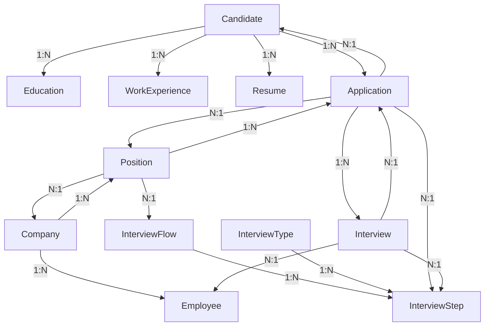

# System Patterns - LTI Talent Tracking System

## Arquitectura del Sistema

### Visión de Alto Nivel

```
┌─────────────────────────────────────────────────────────────┐
│                        FRONTEND                             │
│  React 18 + TypeScript + Bootstrap 5 (Port 3000)            │
│  src/                                                       │
│    ├── components/  (Formularios, Tablas)                  │
│    ├── services/    (API Client)                           │
│    └── App.tsx      (Routing)                              │
└──────────────────────┬──────────────────────────────────────┘
                       │ HTTP/JSON (CORS enabled)
                       │
┌──────────────────────▼──────────────────────────────────────┐
│                       BACKEND API                            │
│  Express + TypeScript (Port 3010)                           │
│  backend/src/                                               │
│    ├── presentation/  (Controllers - futura expansión)     │
│    ├── routes/        (candidateRoutes.ts)                 │
│    ├── application/   (Services, Validators)               │
│    │     ├── services/  (fileUploadService, CandidateService)│
│    │     └── validator.ts                                  │
│    ├── domain/        (Models - DTOs)                      │
│    └── index.ts       (Entry point, middleware setup)      │
└──────────────────────┬──────────────────────────────────────┘
                       │ Prisma Client ORM
                       │
┌──────────────────────▼──────────────────────────────────────┐
│                    POSTGRESQL                               │
│  Docker Container (Port 5433)                               │
│  Database: LTIdb                                            │
│  User: LTIdbUser                                            │
└─────────────────────────────────────────────────────────────┘
```

## Clean Architecture (Backend)

### Capas y Responsabilidades

#### 1. **Domain Layer** (`backend/src/domain/`)
**Responsabilidad:** Entidades de negocio puras, sin lógica de infraestructura.

**Contenido Actual:**
- `models/` - Interfaces TypeScript que reflejan el schema de Prisma
  - `Candidate.ts`
  - `Education.ts`
  - `WorkExperience.ts`
  - `Resume.ts`
  - `Application.ts`
  - `Interview.ts`
  - `Position.ts`
  - `Company.ts`
  - etc.

**Regla:** No importa Prisma Client directamente, solo tipos puros.

#### 2. **Application Layer** (`backend/src/application/`)
**Responsabilidad:** Casos de uso, validación de datos, lógica de negocio.

**Contenido Actual:**
- `services/`
  - `candidateService.ts` - Lógica de creación/actualización de candidatos
  - `fileUploadService.ts` - Manejo de uploads con Multer
- `validator.ts` - Validaciones de entrada de datos

**Próximas Adiciones (Kanban):**
- `candidateService.ts` se extenderá con:
  - `getCandidatesByPosition()` - Query de candidatos por posición
  - `updateCandidateStage()` - Actualización de fase de candidato
  - `calculateAverageScore()` - Cálculo de score promedio

**Regla:** Orquesta el Domain y coordina con Infrastructure (Prisma).

#### 3. **Infrastructure Layer** (Prisma ORM)
**Responsabilidad:** Comunicación con la base de datos.

**Contenido Actual:**
- `backend/prisma/schema.prisma` - Definición de modelos y relaciones
- `backend/prisma/migrations/` - Historial de cambios de schema
- `backend/prisma/seed.ts` - Datos de prueba

**Patrón:** Repository Pattern implícito mediante Prisma Client.

#### 4. **Presentation Layer** (`backend/src/presentation/` + `routes/`)
**Responsabilidad:** Controladores HTTP, serialización de respuestas.

**Contenido Actual:**
- `routes/candidateRoutes.ts` - Definición de endpoints REST para `/candidates`
- `presentation/` - Carpeta creada pero vacía (futura expansión)

**Patern:** Express Router + Middleware chain.

### Flujo de una Request Típica

```
1. HTTP Request (POST /candidates)
         ↓
2. Express Middleware Stack (CORS, JSON parser, Prisma injection)
         ↓
3. candidateRoutes.ts - Identifica handler según método HTTP
         ↓
4. validator.ts - Valida estructura del body
         ↓
5. CandidateService.ts - Lógica de negocio (ej. transformar fechas)
         ↓
6. Prisma Client - Ejecuta transacción en PostgreSQL
         ↓
7. Response JSON (status 201 Created + candidato creado)
```

## Modelo de Datos (Prisma Schema)

### Entidades Core

#### **Candidate** (Núcleo del sistema)
- **Relaciones:**
  - 1:N con `Education`
  - 1:N con `WorkExperience`
  - 1:N con `Resume`
  - 1:N con `Application`

#### **Company** (Multi-tenancy)
- **Relaciones:**
  - 1:N con `Employee`
  - 1:N con `Position`

#### **Position** (Ofertas de trabajo)
- **Relaciones:**
  - N:1 con `Company`
  - N:1 con `InterviewFlow` (define el proceso de entrevistas)
  - 1:N con `Application`

#### **InterviewFlow** (Plantilla de proceso)
- **Relaciones:**
  - 1:N con `InterviewStep` (fases ordenadas)
  - 1:N con `Position` (puede reutilizarse en múltiples posiciones)

#### **InterviewStep** (Fase concreta del proceso)
- **Relaciones:**
  - N:1 con `InterviewFlow`
  - N:1 con `InterviewType` (ej. "Técnica", "Cultural")
  - 1:N con `Application` (FK: currentInterviewStep)
  - 1:N con `Interview` (eventos de entrevista en esta fase)

#### **Application** (Candidatura concreta)
- **Relaciones:**
  - N:1 con `Position`
  - N:1 con `Candidate`
  - N:1 con `InterviewStep` (currentInterviewStep - aquí está ahora)
  - 1:N con `Interview` (historial de entrevistas realizadas)

#### **Interview** (Evento de entrevista)
- **Relaciones:**
  - N:1 con `Application`
  - N:1 con `InterviewStep`
  - N:1 con `Employee` (entrevistador asignado)

### Dependencias entre Módulos



## Patrones de Diseño Aplicados

### 1. **Repository Pattern** (Implícito con Prisma)
```typescript
// No hay repositorio explícito, pero Prisma actúa como tal
const candidate = await req.prisma.candidate.create({
  data: { ... },
  include: { educations: true, workExperiences: true }
});
```

### 2. **Middleware Chain** (Express)
```typescript
// index.ts
app.use(express.json());           // Parser
app.use(corsMiddleware);           // CORS
app.use(prismaInjector);           // Inyección de dependencia
app.use('/candidates', routes);    // Routing
app.use(errorHandler);             // Error handling
```

### 3. **DTO Pattern** (Validación)
```typescript
// validator.ts define la estructura esperada
// Los servicios transforman Request DTO -> Domain Model
```

### 4. **Service Layer Pattern**
```typescript
// CandidateService encapsula lógica de negocio
// No es un controller ni un repositorio, sino orquestador
```

### 5. **Calculated Fields Pattern** (Endpoints Kanban - 2026-01-05)
**Ubicación:** `backend/src/application/services/candidateService.ts`

```typescript
// candidateService.ts - Extensión para Kanban (NO crear ApplicationService)
import { PrismaClient } from '@prisma/client';

export const getCandidatesByPosition = async (
  prisma: PrismaClient,
  positionId: number
) => {
  const applications = await prisma.application.findMany({
    where: { positionId },
    include: {
      candidate: true,
      interviewStep: true,
      interviews: { select: { score: true } }
    }
  });

  return applications.map(app => ({
    candidateId: app.candidate.id,
    fullName: `${app.candidate.firstName} ${app.candidate.lastName}`,
    currentStage: app.interviewStep.name,
    averageScore: calculateAverageScore(app.interviews)
  }));
};

const calculateAverageScore = (interviews: { score: number | null }[]) => {
  const validScores = interviews
    .map(i => i.score)
    .filter((score): score is number => score !== null);
  
  if (validScores.length === 0) return null;
  return validScores.reduce((sum, score) => sum + score, 0) / validScores.length;
};
```

**Regla de Negocio:**
- Si un candidato no tiene entrevistas registradas → `averageScore: null`
- Si tiene entrevistas pero ninguna con score → `averageScore: null`
- Solo se promedian entrevistas con `score !== null`

**Directriz de Simplicidad:**
- ✅ Extender archivo existente (`candidateService.ts`)
- ❌ NO crear nuevo servicio (`ApplicationService.ts`)

---

## Coding Standards y Principios de Diseño

### Principios SOLID Aplicados

#### 1. **Single Responsibility Principle (SRP)**
**Regla:** Cada función debe tener una única responsabilidad.

**Ejemplo Correcto:**
```typescript
// candidateService.ts

// ✅ Función con responsabilidad única: obtener datos
export const getCandidatesByPosition = async (prisma, positionId) => {
  const applications = await fetchApplicationsByPosition(prisma, positionId);
  return mapApplicationsToCandidatesDTO(applications);
};

// ✅ Función con responsabilidad única: mapeo
const mapApplicationsToCandidatesDTO = (applications) => {
  return applications.map(app => ({
    candidateId: app.candidate.id,
    fullName: buildFullName(app.candidate),
    currentStage: app.interviewStep.name,
    averageScore: calculateAverageScore(app.interviews)
  }));
};

// ✅ Función con responsabilidad única: cálculo
const calculateAverageScore = (interviews) => {
  const validScores = interviews
    .map(i => i.score)
    .filter((score): score is number => score !== null);
  
  return validScores.length === 0 
    ? null 
    : validScores.reduce((sum, score) => sum + score, 0) / validScores.length;
};
```

**Ejemplo Incorrecto (❌ Violación de SRP):**
```typescript
// ❌ Función monolítica mezclando DB query, lógica de negocio y mapeo
export const getCandidatesByPosition = async (prisma, positionId) => {
  const apps = await prisma.application.findMany({...});
  return apps.map(app => {
    const scores = app.interviews.filter(i => i.score !== null).map(i => i.score);
    const avg = scores.length ? scores.reduce((a,b) => a+b, 0) / scores.length : null;
    return { 
      candidateId: app.candidate.id, 
      fullName: app.candidate.firstName + ' ' + app.candidate.lastName,
      currentStage: app.interviewStep.name,
      averageScore: avg 
    };
  });
};
```

#### 2. **DRY (Don't Repeat Yourself)**
**Regla:** Reutilizar lógica existente, no duplicar código.

**Buena Práctica:**
- Si ya existe `buildFullName()` en otro servicio → importar y reutilizar
- Si ya existe helper para filtrar valores null → reutilizar
- Centralizar lógica de manejo de errores en middleware

#### 3. **Open/Closed Principle**
**Aplicación:** Las validaciones de negocio deben ser extensibles sin modificar el core.

```typescript
// ✅ Extensible mediante configuración
const validations = {
  allowBackwardMovement: false,  // Configurable
  requireScoreThreshold: null    // Futuro: requerir score mínimo
};

export const updateCandidateStage = async (prisma, candidateId, positionId, newStepId) => {
  // Aplicar validaciones configurables
  if (!validations.allowBackwardMovement) {
    await validateForwardMovement(application, newStepId);
  }
  // ...
};
```

#### 4. **Separation of Concerns**
**Estructura del archivo `candidateService.ts`:**

```typescript
// === SECCIÓN 1: Queries a Base de Datos ===
const fetchApplicationsByPosition = async (prisma, positionId) => { /* ... */ };
const fetchApplicationForUpdate = async (prisma, candidateId, positionId) => { /* ... */ };

// === SECCIÓN 2: Transformaciones y Mapeo ===
const mapApplicationsToCandidatesDTO = (applications) => { /* ... */ };
const buildFullName = (candidate) => `${candidate.firstName} ${candidate.lastName}`;

// === SECCIÓN 3: Lógica de Negocio ===
const calculateAverageScore = (interviews) => { /* ... */ };
const validateInterviewStepBelongsToFlow = (interviewFlow, stepId) => { /* ... */ };

// === SECCIÓN 4: Funciones Públicas (Exported) ===
export const getCandidatesByPosition = async (prisma, positionId) => { /* ... */ };
export const updateCandidateStage = async (prisma, candidateId, positionId, newStepId) => { /* ... */ };
```

### Estándares de TypeScript

#### Tipado Estricto
```typescript
// ✅ Interfaces explícitas para DTOs
interface CandidateKanbanDTO {
  candidateId: number;
  fullName: string;
  currentStage: string;
  averageScore: number | null;
}

// ✅ Tipos de retorno explícitos
export const getCandidatesByPosition = async (
  prisma: PrismaClient,
  positionId: number
): Promise<CandidateKanbanDTO[]> => {
  // ...
};

// ❌ Evitar tipo 'any'
const badExample = async (data: any) => { /* ... */ };  // NO HACER
```

#### Nombres Semánticos
```typescript
// ✅ Variables auto-explicativas
const validScoresForAverage = interviews
  .map(interview => interview.score)
  .filter((score): score is number => score !== null);

// ❌ Variables crípticas
const vs = interviews.map(i => i.s).filter(s => s !== null);  // NO HACER
```

### Gestión de Errores

**Patrón consistente:**
```typescript
export const updateCandidateStage = async (...) => {
  // Validación de entrada
  if (!positionId || !newInterviewStepId) {
    throw new Error('Missing required parameters');
  }

  // Lógica de negocio
  const application = await fetchApplicationForUpdate(...);
  
  if (!application) {
    throw new Error('Application not found');  // Error específico para 404
  }

  if (!isValidStepForPosition(application, newStepId)) {
    throw new Error('Invalid interviewStepId for this position');  // Error específico para 400
  }

  // Operación exitosa
  return await prisma.application.update(...);
};
```

### Referencias
- **Documento de Buenas Prácticas:** [LIDR - AI4Devs Rookies](https://training.lidr.co/posts/ai4devs-202510-rookies-%F0%9F%93%84-buenas-practicas-aplicadas-con-ai-caso-lti-%F0%9F%94%B4-33-min)
- **Principios SOLID:** [Clean Code by Robert C. Martin]
- **TypeScript Best Practices:** [Official TypeScript Handbook]

---

## Reglas de Modificación


### Backend (`c:\Users\pedro.cortes\source\ai4devs\09-backend\backend\`)
```
backend/
├── src/
│   ├── index.ts              [Entry point: Express init, middleware, routes]
│   ├── application/
│   │   ├── services/
│   │   │   ├── CandidateService.ts   [Lógica de creación de candidatos]
│   │   │   └── fileUploadService.ts   [Multer config para CVs]
│   │   └── validator.ts               [Validaciones con regex y lógica custom]
│   ├── domain/
│   │   └── models/                    [Interfaces TypeScript puras]
│   ├── presentation/                  [VACÍO - futura expansión de controllers]
│   └── routes/
│       └── candidateRoutes.ts         [Endpoints: GET/POST/PUT/DELETE /candidates]
├── prisma/
│   ├── schema.prisma          [Schema ORM con 10 modelos]
│   ├── migrations/            [Historial de cambios de DB]
│   └── seed.ts                [Script de datos de prueba]
├── dist/                      [Compilado de TypeScript (npm run build)]
└── package.json               [Scripts: dev, start, build, test]
```

### Frontend (`c:\Users\pedro.cortes\source\ai4devs\09-backend\frontend\`)
```
frontend/
├── src/
│   ├── App.tsx                [Router principal]
│   ├── components/
│   │   ├── AddCandidate/      [Formulario de creación]
│   │   └── CandidateItem/     [Card/List item de candidato]
│   ├── services/
│   │   └── api.ts             [Axios/Fetch wrapper para backend]
│   └── index.tsx              [Entry point React]
├── public/                    [Assets estáticos]
└── package.json               [Scripts: start, build, test]
```

## Reglas de Modificación

### ❌ NO HAGAS ESTO sin actualizar systemPatterns.md:
1. Añadir una nueva carpeta en `src/` (ej. `infrastructure/repositories/`)
2. Cambiar el schema de Prisma (añadir modelo, modificar relación)
3. Cambiar el puerto del backend o la URL de CORS
4. Introducir un nuevo patrón arquitectónico (ej. CQRS, Event Sourcing)

### ✅ SÍ puedes hacer sin actualizar:
1. Añadir un nuevo campo a un modelo existente (pero documenta en progress.md)
2. Crear un nuevo service dentro de `application/services/`
3. Añadir validaciones al `validator.ts`
4. Crear nuevos componentes React en `components/`

### Protocolo de Actualización:
Si modificas la arquitectura:
1. Edita primero `memory-bank/systemPatterns.md`
2. Registra la decisión técnica en `memory-bank/decisions.md`
3. Actualiza `memory-bank/techContext.md` si cambia el stack
4. Luego ejecuta los cambios en código
